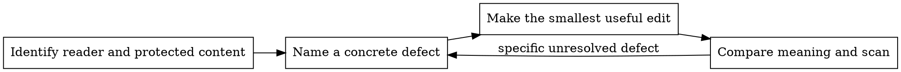

# Deslop

Remove formulaic writing that obscures meaning or flattens the author's voice. Name the reader's problem before editing: an unsupported claim, a repeated conclusion, an unclear actor, or a sentence that needs rereading. A recognizable word or construction alone is not a defect.

**Preserve meaning first.** Keep facts, qualifications, attribution, and the author's stance. Improve clarity within the requested scope. Never invent measurements, mechanisms, anecdotes, or confidence to make a vague sentence sound specific. `NO_EDITS` is a successful result when the draft already works.

## Surface first

The user, publication, and project contract set the register. An artifact's authority skill decides its structure; this skill supplies prose diagnostics.

| Surface                                | Authority and preservation                                                                        |
| -------------------------------------- | ------------------------------------------------------------------------------------------------- |
| PR body, PR comment reply              | `super-good-pr`; preserve semantic emoji, reviewer guidance, receipts, and human-authored choices |
| PR review report                       | `hyper-pr-review`; preserve severity and finding structure                                        |
| Commit body                            | Repository commit rules; plain text and required trailers                                         |
| Spec, plan, research report            | Preserve decisions, alternatives that matter, uncertainty, citations, and requirements            |
| README, docs, guides                   | Explain the actual system; preserve commands, examples, signatures, and error strings             |
| Changelog, release notes               | Narrating the change is the purpose; keep versions and migration consequences                     |
| Slack, email                           | Match the sender; preserve signatures and thread links                                            |
| Blog, essay, fiction                   | Match the author; creative invention is allowed only within the creative brief                    |
| Scientific, legal, medical, postmortem | Preserve calibrated uncertainty and approved language                                             |
| Marketing                              | Follow the brief; persuasion does not authorize invented claims                                   |
| Agent brief, skill, memory             | Keep useful tables and terminology; clarity and factual checks still apply                        |
| Interactive chat                       | Skip a separate pass; follow the project register                                                 |

Read `references/surface-profiles.md` when a surface needs a worked example. A writing sample guides voice; it does not override an explicit instruction from the user.

## A focused editing loop

Use the depth the artifact needs. A short message can be edited in one pass. For a long or consequential document, separate diagnosis from rewriting so the rewrite has an explicit target. Independent review can help when semantic drift would be costly; a second model is not proof of correctness.



For an audit, report the span, defect, and suggested edit without changing the artifact. For an authorized rewrite, keep the diagnosis internal unless the user asks for it. Do not manufacture a finding quota or require several weak markers before fixing one clear ambiguity.

### Mechanical scan

Run the bundled scanner from the repository root, or resolve its path relative to this skill's directory when installed elsewhere:

```bash
perl skills/deslop/scripts/slopscan.pl --surface house FILE...
# Surfaces: house | published | agent | sample
# --show-masked lists protected hits suppressed by the masker.
# Exit: 0 no findings, 10 candidates, 20 hard findings, 30 unreadable input.
```

Choose `house` for our prose, `agent` for our instruction files, and `published` or `sample` for another author's work. The house dash ban is a style requirement, not evidence of authorship. Typography on other surfaces needs contextual judgment (a non-breaking space may be intentional localization).

The scanner is read-only and uses a heuristic Markdown masker. It protects frontmatter, code, blockquotes, comments, and link targets. It also reports raw hard hits suppressed by masking; inspect those when quoting or nested lists make the mask uncertain. A known limitation is a list fence whose closing indentation exceeds three spaces. A clean exit establishes only that the enabled checks found nothing in the visible text they recognized. It does not establish prose quality or parser completeness.

Treat candidates as prompts to inspect, never automatic replacements. Rhythm diagnostics are descriptive: short technical instructions can legitimately have uniform sentence lengths. Run `scripts/selftest.sh` after changing scanner behavior.

### Read in order of consequence

Start with missing meaning or a confusing argument, then work toward sentence detail. These are diagnostic lenses, not five mandatory invocations:

| Lens       | Look for                                                                        | Useful move                                                               |
| ---------- | ------------------------------------------------------------------------------- | ------------------------------------------------------------------------- |
| Document   | Repeated summaries, decorative headings, reasoning split into unrelated bullets | Keep the structure that helps the reader navigate or act                  |
| Argument   | Inflated significance, unsupported attribution, imaginary counterarguments      | State the actual claim and its support                                    |
| Sentence   | Unclear actor, buried action, clause stacks, empty participial tails            | Give the relevant subject a clear verb; split only where meaning benefits |
| Vocabulary | Filler, imprecise metaphor, jargon the reader cannot interpret                  | Use the precise familiar term; preserve defined terminology               |
| Evidence   | Invented specificity, overstated certainty, stale claims, process narration     | Restore qualifications and attribution; flag source gaps                  |

The catalog in `references/pattern-catalog.md` gives stable IDs and examples. Consult relevant entries instead of loading every rule for every artifact. The craft moves in `references/craft-moves.md` help when a sentence's shape is the problem.

## Preservation contract

- Preserve code, commands, configuration, quoted language, links, and required metadata unless their modification is part of the request.
- Preserve negation, quantities, units, scope, time, and causal strength. Changing "may" to "will" or "associated with" to "causes" changes the claim.
- Keep every substantive fact unless the user requested substantive cuts. Remove repetition only when its function is also redundant (reminders in procedures can be necessary).
- Reuse defined terms. Synonym variation can accidentally invent a second component or loosen a contractual term.
- Keep protected legal text and meaningful safety instructions even when they sound formulaic.
- Match the author's voice. Do not manufacture errors, arbitrary sentence variation, personal experience, or artificial informality.

Examples in the references are illustrative. Added specifics are usable only when the source material supports them. If a vague draft lacks the necessary facts, keep a plain version or flag what evidence is missing.

## Verify the edit

Compare the original and revised text for changed meaning before scanning typography. Check that every new factual clause has support and that deleted clauses did not carry a requirement, exception, or qualification. Use the actual diff for files; reread the complete artifact when edits changed its structure.

Fix identified regressions and repeat the relevant check. Stop when the requested improvements are complete and no concrete defect remains. Do not chase a detector score, a sentence-length target, a percentage reduction, or a vague feeling that a text still sounds generated.

For difficult passages, useful questions are: what would deletion lose; what does a named source actually support; could this paragraph describe any project; and does the same term mean the same thing throughout? A required boilerplate paragraph can pass even when it is portable.

## Invocation modes

| Mode     | Result                                                             |
| -------- | ------------------------------------------------------------------ |
| Embedded | Return or insert the finished text without an audit preamble       |
| File     | Edit the authorized prose and summarize material changes           |
| Pasted   | Return the revision; explain the edits when requested              |
| Gate     | Report concrete unresolved defects and applicable style violations |
| Audit    | Give located feedback without rewriting or judging authorship      |

Default to embedded when another skill invokes this one. An audit request does not authorize file edits or publication.

## Research boundary

Studies show differences between particular model outputs and human corpora. They do not establish universal forbidden constructions or predict Astra's writing on a new task. Technical prose, fiction, and biomedical abstracts have different requirements. Use research to challenge folklore and identify candidates, then judge the actual text. Verified sources, limits, and maintenance guidance live in `references/evidence.md`.

## Anti-patterns

| Mistake                                         | Correction                                             |
| ----------------------------------------------- | ------------------------------------------------------ |
| Fix a wordlist and stop                         | Check the argument and meaning first                   |
| Require several markers for an obvious defect   | Report the defect on its own evidence                  |
| Turn a vague claim into an invented measurement | Use supplied evidence or retain a plain limited claim  |
| Strip every hedge, passive, heading, or list    | Judge its function and the surface                     |
| Apply our typography to another author's sample | Follow the requested register and explicit constraints |
| Treat scanner output as a rewrite command       | Inspect candidates and protected regions               |
| Keep rewriting toward an arbitrary score        | Stop on satisfied requirements and preserved meaning   |

## What This Skill is NOT

- An authorship detector or a detector-evasion tool. Never infer who wrote a passage from stylistic markers.
- A mandatory rewrite into one house voice.
- A replacement for an artifact's template, structure authority, or source evidence.
- A full fact-check unless requested. Surface a concrete factual problem encountered during editing instead of silently polishing it into authority.

## References

- `references/pattern-catalog.md`: stable diagnostic IDs and examples.
- `references/craft-moves.md`: sentence and paragraph repairs.
- `references/surface-profiles.md`: artifact-specific preservation and worked rewrites.
- `references/evidence.md`: checked research and its limits.
- `scripts/slopscan.pl`, `scripts/selftest.sh`, and `references/fixtures/`: mechanical checks and regression coverage.
