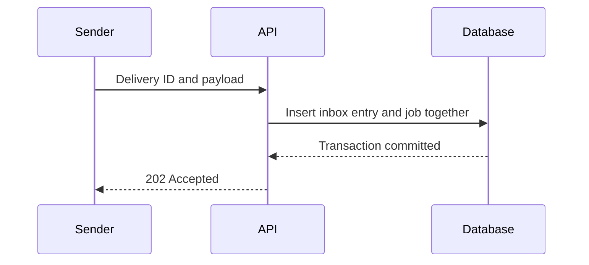

# PR descriptions from evidence

These examples are illustrative, not records of changes or tests in this repository. Each factual packet supplies everything the resulting description may claim. Reuse the judgment and reading order, not the fictional commands or domain details.

## Small fix: explain the whole change without scaffolding

### Factual packet

- Clearing the search input currently leaves `q=` in the URL. The filter chip renders whenever the query parameter exists, so an empty search leaves an empty chip.
- The change deletes the query parameter when the input becomes empty and preserves other filter parameters.
- The regression test failed before the change and passes afterward. The command `pnpm test search-filter` passes, including the case with a separate status filter. No other checks were run.

### Result

**Title:** Clear the search filter when its input is empty

```markdown
Clearing the search input leaves an empty filter chip because the URL still contains `q=`. The change removes the query parameter when the input becomes empty, clearing the chip while preserving the other filters.

The regression failed before the fix and now passes in `pnpm test search-filter`, including the case with a separate status filter.
```

The trigger, visible consequence, mechanism, and evidence fit without headings. The description makes no claim about unrelated checks and does not pad the body with untouched components.

## Complex change: distinguish acceptance from completion

### Factual packet

- The API queues a new job for every webhook request. A sender retry after a lost acknowledgment currently queues the same delivery again.
- Senders provide a stable sender ID and delivery ID across retries. An inbox table has a unique constraint on that pair and stores a payload digest.
- For a new delivery, the API inserts the inbox entry and job in one database transaction. It returns `202` after commit. A matching retry returns `202` without another job; reuse of the ID with different content returns `409`.
- Workers process jobs at least once. A worker crash after a provider accepts an outbound request can still repeat the provider operation. The change does not solve that downstream problem.
- The PostgreSQL integration checks passed for simultaneous matching requests producing one job, mismatched payloads returning `409`, and a failed transaction producing neither record. The provider was mocked; live provider behavior was not exercised.
- The recorded commands are `pytest tests/integration/test_webhook_acceptance.py` and `pytest tests/integration/test_webhook_transaction_failure.py`. No CI result is available.
- Deployment requires the inbox migration before the API rollout. Older API replicas still use the old path, so deduplication applies across requests only after all API replicas are updated.
- The acceptance transaction is in `accept_delivery`. No repository URL or revision permalink was supplied.

### Result

**Title:** Deduplicate accepted webhook deliveries

````markdown
When a sender retries a webhook after losing the acknowledgment, the API currently queues the same delivery again. The API now records each sender and delivery ID with its job in one transaction. Matching retries reuse the accepted delivery instead of adding another job.

Acceptance does not mean processing has finished. Workers still process jobs at least once, and a crash after the downstream provider accepts a request can repeat that operation.

## 🛠️ Commit before acknowledging

For a new delivery, the database commit establishes acceptance before the API returns `202`:



The unique sender and delivery ID pair handles competing requests. A matching retry receives `202` without another job. Reusing the ID with a different payload returns `409`.

Start review with the transaction in `accept_delivery`: the inbox entry and job must commit together, and acknowledgment must follow that commit.

## 🚦 Rollout

Apply the inbox migration before deploying the API. Deduplication across requests takes effect once all API replicas are updated; older replicas still queue deliveries through the previous path.

## 🧪 Validation

The PostgreSQL integration checks passed: simultaneous matching requests create one job, conflicting payloads receive `409`, and a failed transaction leaves neither record. The provider was mocked, so live provider behavior remains unverified. No CI result is available.

<details>
<summary>Recorded integration commands</summary>

```bash
pytest tests/integration/test_webhook_acceptance.py
pytest tests/integration/test_webhook_transaction_failure.py
```

</details>
````

The diagram answers an ordering question. Its scope is explicitly a new delivery, so it does not imply that retries repeat the insert or that `202` proves downstream success. The readiness limits stay visible; only reproduction detail is collapsed. A real PR should link the decisive function when its location is known, without fabricating a permalink.

## Scoped edit: preserve the human's artifact

### Factual packet and existing text

The user authorizes updating **only Validation**. The title and other sections are human-authored and frozen. The commit message was amended, with a verified identical final tree; the previous local check remains applicable. Required CI for the new head is queued. The earlier local command was `pnpm test cache-key`, which passed. There is no fresh CI result to report.

Existing title: **Keep cache entries separate for each account**

```markdown
## 💡 Why

Switching accounts should not bring the previous account's cached results along for the ride. The cache key now includes the account ID.

## 🧪 Validation

Pending.

## 📌 Follow-up

Keep the migration note linked from the release checklist. 💜
```

### Result: replace only the authorized section

```markdown
## 🧪 Validation

The local check `pnpm test cache-key` passed before the commit-message amend. The final tree is unchanged, so that result remains applicable. Required CI for the new head is queued.
```

The polished artifact is the scoped edit, not a rewritten template. The title, voice, emoji, and follow-up survive unchanged. The validation statement distinguishes applicable local evidence from pending head-specific CI.

## Basis and limits

Primary guidance checked September 2026:

- Google's [CL description guidance](https://google.github.io/eng-practices/review/developer/cl-descriptions.html) supports an informative standalone title, context about what and why, and a description that reflects the final change. Its CL conventions inform these examples; repository-specific PR rules still govern.
- GitHub's [guidance for helping reviewers](https://docs.github.com/en/pull-requests/concepts/helping-others-review-your-changes) supports focused changes, clear context, and direction toward important code or questions. It does not establish a universal PR-size threshold or a causal guarantee that a formatting choice improves review outcomes.
- GitHub documents [collapsed sections](https://docs.github.com/en/get-started/writing-on-github/working-with-advanced-formatting/organizing-information-with-collapsed-sections) and [Mermaid diagrams](https://docs.github.com/en/get-started/writing-on-github/working-with-advanced-formatting/creating-diagrams). Support for a format is not a reason to use it everywhere. Keeping decision-changing limits visible is this skill's editorial judgment.

Treat these examples as craft demonstrations. Test the skill on fresh factual packets to assess omission, unsupported claims, preservation of uncertainty, and whether a reader can explain the change without reconstructing it from the diff.
