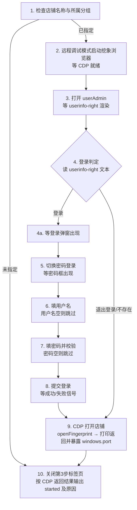

# 挖象浏览器启动店铺

本技能封装“在挖象浏览器中远程打开某个店铺”的完整可执行流程。按给定步骤执行，在登陆状态下打开指定分组指定名称的店铺，未登录时先执行登录流程。

## ⚠️ 用户警告（User Warning）与安全声明

> **执行前必须先向用户展示本节并获得用户确认**：未确认前不得执行启动浏览器及登录。

1. **凭据使用（Credential Use）**：本技能会使用用户主动提供的挖象账号（手机号）与密码完成登录。凭据无任何内置默认值；仅通过 HTTPS 提交至挖象官方登录页（`https://hao.waxiang.com`）；不写入日志、不写入文件、不用于其他用途、不发送给任何第三方。
2. **本地调试端口（Local Debug Port）**：本技能会以 `--remote-debugging-port` 在本机启动挖象浏览器，调试端口仅绑定本机回环地址（`127.0.0.1`），仅本机进程可访问；任务结束即断开调试连接。请仅在可信设备上执行。
3. **本地进程与文件（Local Processes & Files）**：打开店铺会在本机启动新的浏览器进程与窗口；文件访问仅限挖象浏览器自身与其专用用户数据目录，**不做文件系统枚举（No File System Enumeration）**、不扫描或读取无关目录。
4. **数据不外传（No External Data Transmission）**：除访问挖象官方域名与本机回环地址（`127.0.0.1`）外，本技能不向任何其他地址传输数据；无遥测、无数据收集、不上传本地文件。第 9 步输出的店铺调试端口仅在本机日志/返回值中使用（供同一台机器上的后续自动化），不通过网络外发。

### 权限与数据使用清单

| 项目 | 用途 | 范围与限制 |
| --- | --- | --- |
| 用户凭据（手机号/密码） | 登录挖象账号 | 运行时由用户提供；仅提交挖象官方 HTTPS 登录页；不落盘、不入日志、不外传 |
| 网络访问 | 登录、打开店铺 | 仅 `hao.waxiang.com`（挖象官方）与 `127.0.0.1`（本机 CDP）；无第三方地址 |
| 环境变量 | 拼装默认安装路径 | 仅将 `%LocalAppData%` 作为 Windows 默认路径占位符（可由用户显式覆盖）；不读取其他环境变量内容（No Env Variable Harvesting） |
| 本地文件 | 启动浏览器 | 仅挖象浏览器可执行文件与其专用用户数据目录；不枚举文件、不读取其他文件 |
| 本地进程 | 启动浏览器/店铺窗口 | 用户主动发起的正常业务操作；调试端口仅本机可用 |

## 适用场景

- “打开店铺”
- “把 XXX 店铺打开/跑起来”
- “远程启动挖象店铺 <店铺名>”

## 前置参数

| 参数 | 必填 | 说明 |
| --- | --- | --- |
| 挖象浏览器路径 | 可选 | 默认 `%LocalAppData%\WaXiangBrowser\waxiang.exe` |
| 挖象用户名 | 可选 | 手机号，登录用（无内置默认值，运行时由调用方提供） |
| 挖象密码 | 可选 | 登录用（无内置默认值，运行时由调用方提供） |
| 待启动店铺名称 | **必填** | 未指定则直接结束 |
| 待启动店铺所属分组名称 | **必填** | 未指定则直接结束 |
| 监听端口 | 可选 | 选用空闲端口（如 `9222`） |
| 用户数据目录 | 可选 | 按账号隔离，建议使用独立目录（如 `%LocalAppData%\.waxiang-<账号>-profile`），避免登录态串号 |

> 若用户名/密码未给出，按“已登录”前提执行：启动后先做登录判定（第 4 步），已登录则跳过登录分支。

## 流程总览



## 执行步骤

> **统一约定：条件等待 + 超时兜底（不使用固定停顿）**
> - `等待(条件, 超时, 轮询间隔=300ms)`：在目标页面用 JS 每 300ms 轮询一次条件，成立立即继续；超时仍未成立则执行该步“兜底”分支（记录原因并结束或补救）。
> - 条件一旦满足马上继续：正常网络下多数步骤 1~2s 内完成；超时上限仅用于防卡死/防误判。
> - 判定类步骤（登录成功、登录态、CDP 返回结果）改为“监测成功/失败信号”，而非空等固定时长。

### 1. 检查待启动店铺名称与所属分组

店铺名称或所属分组未指定则直接结束：未指定店铺名 → 跳到第 10 步结束（`started=false`，原因=`未指定店铺名`）；未指定分组 → 跳到第 10 步结束（原因=`未指定分组名`）。

### 2. 启动浏览器

选用空闲端口（如 `9222`），以远程调试模式启动挖象浏览器（敏感操作，需先向用户展示《用户警告与安全声明》）：

```
waxiang.exe --remote-debugging-port=9222 --user-data-dir=<独立目录> --remote-allow-origins=* --no-first-run --no-default-browser-check --test-model about:blank
```

> 安全说明：调试端口仅绑定本机回环地址（`127.0.0.1`），不对局域网/公网开放；`--remote-allow-origins=*` 仅为兼容会携带 Origin 头的本机调试客户端，若所用客户端不发送 Origin 头可移除该开关。请仅在可信设备上执行。

等待：轮询探测 `http://127.0.0.1:9222/json/version` 可访问（每 500ms，超时 30s）。兜底：超时未就绪 → 结束（原因=`浏览器未就绪`）。

### 3. 打开 userAdmin 并等待登录控件渲染

在当前标签页打开 `https://hao.waxiang.com/account/userAdmin`。

等待条件：`userinfo-right` 元素已渲染（首选 XPath `//div[contains(@class,'userinfo-right')]`，失败用备选绝对路径）；轮询 300ms，超时 20s。

兜底：超时仍未出现 → 追加一次判定：
- 若页面已出现登录弹窗（`.el-dialog` 内含手机号输入框 `input[@placeholder='请输入手机号']`）或已跳转登录页 → 说明已处于登录入口，直接进入第 5 步；
- 否则 → 结束（原因=`登录控件未渲染`）。

> 先确认控件渲染完成再做判定，避免把“页面还没加载出来”误判成“已登录”。

### 4. 登录判定（幂等分支）

读取第 3 步已确认存在的 `userinfo-right` 文本：
- 为 `登录`：点击该元素 → 执行 4a；
- 为 `退出登录`：已登录，跳过第 5~8 步，直接到第 9 步（CDP 打开店铺）。

说明：该元素是登录/登出切换控件，未登录显示“登录”，已登录显示“退出登录”。

#### 4a.（点“登录”后）等待登录弹窗

等待条件：弹窗内出现 `input[@placeholder='请输入手机号']`；轮询 300ms，超时 10s。兜底：超时未出现 → 结束（原因=`登录弹窗未出现`）。

### 5. 切换密码登录（仅登录分支执行）

密码图标 XPath：`//img[contains(@class,'icon-img') and contains(@src,'pwd')]`

- 未命中：点击“其他登录方式”，等待密码图标出现（轮询 300ms，超时 5s）；仍无 → 结束（原因=`无其他登录方式入口`）。
- 点击密码图标后：等待弹窗内出现 `input[@type='password']`（轮询 300ms，超时 8s）。兜底：未出现 → 结束（原因=`密码登录表单未出现`）。

### 6. 填入用户名

前置条件：仅当挖象用户名非空时才定位并输入；为空则跳过本步（不定位、不输入），继续第 7 步。

定位 `input[@placeholder='请输入手机号']`，用 value setter 清空并写入、触发 `input`/`change` 事件。

校验（替代停顿）：立即回读 `value` 应等于用户名；未即时生效则轮询至多 3 次（300ms 间隔）；仍不一致 → 重填 1 次 → 再失败则结束（原因=`用户名填写失败`）。

### 7. 填入密码

前置条件：仅当挖象密码非空时才定位并输入；为空则跳过本步（不定位、不输入），继续第 8 步。

定位 `input[@type='password']`，同上写入并回读校验；失败重填 1 次，仍失败 → 结束（原因=`密码填写失败`）。
附加：填完后检测一次验证码/滑块（`img[src*='captcha'|'verify']`、`canvas` 或“滑块/验证”文案），仅作第 8 步失败预判提示，不需停顿。

### 8. 提交登录（按成功/失败信号等待）

点击“登录”按钮：首选 XPath（锚定手机号输入框所在表单）`//form[.//input[@placeholder='请输入手机号']]//div[contains(@class,'btn') and contains(.,'登录')]`；兜底 1 为绝对路径 `/html/body/div[1]/div/div[2]/div/div/div/div/div[2]/form/div[4]/div/div`；兜底 2 为弹窗内可见且文本为“登录”的叶子元素。

等待（轮询 400ms，窗口 A 30s）：
- 成功信号：`userinfo-right` 变为 `退出登录`，或 URL 离开登录态进入账号相关页面 → 继续第 9 步（CDP 打开店铺）；
- 失败信号（同步监测）：`.el-message` 错误提示（含 密码/账号/验证 等）或滑块/验证码出现 → 结束（原因=`登录失败:<错误文本>`）。
- 兜底 1：窗口 A 30s 内无任何信号 → 不判失败，进入“登录后台补发监控”（防御性兜底，每 1s 轮询，最长再等 90s；登录正常 1~3s 即成功，此兜底仅在页面信号延迟/网络波动时生效）：
  - 出现成功信号 → 视为登录成功，继续第 9 步（CDP 打开店铺，即登录完成后自动补发 openFingerprint）；
  - 出现失败信号 → 结束（原因=`登录失败:<错误文本>`）；
  - 累计仍无信号 → 结束（原因=`登录结果未知`）。

### 9. 通过 CDP 打开指定店铺（已登录 / 登录成功后执行）

已登录（第 4 步判为“退出登录”）或第 8 步登录成功后执行本步；**替代原“打开 accManage 查表点启动”的 DOM 流程**，本流程不再访问 accManage 页面，因此不存在“关闭唯一标签页导致主窗口退出、终止启动中店铺”的风险。

`FingerprintCenter.openFingerprint` 是**浏览器级会话**上的自定义方法，须连接浏览器级调试端点（勿连页面 target）；CDP 即经该调试 WebSocket 收发 JSON-RPC 报文。

动作：
1. 取浏览器级调试端点：`GET http://127.0.0.1:<监听端口>/json/version`（`<监听端口>` = 第 2 步选定的空闲端口，非固定 9222），读取返回中的 `webSocketDebuggerUrl`（形如 `ws://127.0.0.1:<监听端口>/devtools/browser/<uuid>`）；
2. 用 WebSocket 客户端连上该地址；
3. 发送一条 JSON-RPC 请求帧（`id` 自增且唯一），把“打开指定店铺”指令直接发过去：

   ```json
   {"id": 1, "method": "FingerprintCenter.openFingerprint", "params": {"shopName": "<待启动店铺名称>", "teamName": "<待启动店铺所属分组名称>"}}
   ```

4. 等待服务端返回 **`id` 与请求一致** 的响应帧，解析该响应帧中的数据：`windows.port` 就是新打开的店铺所在浏览器的 CDP 远程调试端口，向上暴露这个端口供 AI Agent 进一步使用（`JSON.stringify` 格式化输出）；本步以该返回结果为准判定，不再做任何 DOM 二次校验。该端口仅用于同一台机器上的后续自动化（仅输出到本机日志/返回值），不通过网络外发。

判定（以 CDP 返回结果为准）：
- 收到响应且返回内容无错误（无错误码/错误信息字段）→ `started=true`，原因=`CDP 已请求打开店铺`（详见日志返回）；
- 返回内容含错误（错误码/错误信息）→ `started=false`，原因=`CDP 打开店铺失败:<返回中的错误文本>`；
- 建连/发送/等待超时、连接断开或未收到匹配 `id` 的响应 → `started=false`，原因=`CDP 调用失败:<异常信息>`。

收尾：关闭该 WebSocket 调试连接（仅断开调试连接，不关闭挖象浏览器主窗口/店铺窗口）。

### 10. 结束

关闭第 3 步中用到的标签页，再输出结论：`started=true/false` 及原因（CDP 已请求打开店铺 / CDP 打开店铺失败:<错误> / CDP 调用失败:<异常> / 登录失败:<错误> / 登录结果未知 / 登录弹窗未出现 / 登录控件未渲染 / 浏览器未就绪 / 未指定店铺名 / 未指定分组名 等）。

## 注意事项

- 店铺名称与所属分组是必填参数（分别作为 `openFingerprint` 的 `shopName`/`teamName`）；浏览器路径有内置默认值；用户名/密码**无内置默认值**（运行时由调用方提供，未提供时按“已登录”前提处理，第 6/7 步会自动跳过填入）。
- 用户数据目录务必按账号隔离（独立 `--user-data-dir`），防止登录态串号。
- 打开店铺一律通过 CDP 命令 `FingerprintCenter.openFingerprint` 完成：取 `/json/version` 的 `webSocketDebuggerUrl` → WebSocket 连接 → 发送 JSON-RPC 请求帧（`method`=`FingerprintCenter.openFingerprint`、`params`=`{shopName, teamName}`）→ 按 `id` 匹配响应帧；不再操作 accManage 页面 DOM，也不存在“关闭唯一标签页＝关闭主窗口、终止启动中店铺”的风险。
- **日志要求**：发送后必须把该 CDP 请求的返回结果完整打印到日志（`JSON.stringify(result, null, 2)`），并以返回内容为准判定成败；同时解析 `windows[].port`（新开店铺浏览器的 CDP 远程调试端口）并向上暴露，供 AI Agent 后续使用（`-1` 表示该窗口未提供端口；该端口仅限本机使用，不外发）。
- 一律用“条件等待 + 超时兜底”，不要写死停顿：等待对象是**元素出现 / 登录成功或失败信号**，而非固定秒数。
- 定位优先使用属性 XPath（更抗页面结构调整），绝对路径仅在首选失效时作为兜底。
- 登录是幂等分支：已登录的浏览器应跳过登录分支，直接执行第 9 步 CDP 打开。
