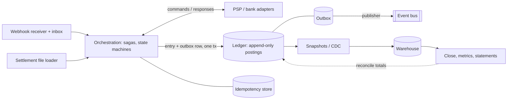

# Architecture and operations for money systems

A money system fails in production for reasons unrelated to arithmetic. The amounts are right; the
_delivery_ is wrong — a retry charges twice, a webhook arrives before the object it describes exists, a
provider times out and nobody knows whether funds moved, a cached balance drifts, a migration edits
history. This reference covers the machinery around the ledger: separating concerns, moving money across
systems you do not control, making effects exactly-once when transport never is, and running, testing,
observing, recovering and changing the thing without losing an entry. Arithmetic is
`money-arithmetic.md`, the posting model `ledger.md`, rails `payments.md` and `banking-open-finance.md`,
matching and close `reconciliation-close.md`.

## 1. Reference architecture: four separable concerns

Four concerns, four rates of change, four owners. Collapsing them is the usual mistake, whose shape is
always a `Payment` class holding provider ids, driving a state machine and feeding the dashboard.

| Concern           | Owns                                                                  | Changes when                               | Never contains                               |
| ----------------- | --------------------------------------------------------------------- | ------------------------------------------ | -------------------------------------------- |
| **Orchestration** | Flow state machines, sagas, compensations, retries, timers, approvals | Product or rail behaviour changes          | Balance math, provider SDK types             |
| **Ledger**        | Accounts, entries, postings, holds, periods, balance derivation       | The accounting policy changes (rarely)     | HTTP, retry logic, provider ids as semantics |
| **Integration**   | Rail and provider adapters, wire formats, signatures, webhooks, files | A provider changes its API, or you add one | Business rules, posting decisions            |
| **Reporting**     | Snapshots, warehouse models, metrics, close artifacts, statements     | Finance asks a new question (often)        | Any write back into the ledger               |



**Dependencies point inward and the ledger is the innermost ring.** The ledger module does not import
the Stripe SDK, does not know the word "webhook", and would compile if every provider disappeared.
Orchestration knows the _shape_ of a rail (authorize, capture, settle, reverse, with a reversal window)
but never a vendor; only adapters know vendors. Broken, with the wire type in the domain:

```python
# BROKEN
def refund(order_id: str, pi: stripe.PaymentIntent, amount: float) -> stripe.Refund:
    r = stripe.Refund.create(payment_intent=pi.id, amount=int(amount * 100))  # float (M4), no key (M7)
    db.execute("UPDATE orders SET refunded = refunded + %s WHERE id = %s", (amount, order_id))
    return r                                    # balance mutated in place (M1), no counter-entry (M2)
```

Fixed, with a port in the domain and an adapter at the edge:

```python
@dataclass(frozen=True, slots=True)
class Money: minor: int; currency: str   # exact quantity + ISO 4217, never a float (M4)

@dataclass(frozen=True, slots=True)
class RefundCommand:                     # our reference and our key, no provider object
    capture_ref: str; amount: Money; idempotency_key: str      # key from the action (M7)

class RefundPort(Protocol):              # one implementation per provider, in the adapter ring
    def refund(self, cmd: RefundCommand) -> RefundResult: ...  # status, provider_ref, fees

def refund_order(order_id, amount: Money, port: RefundPort, ledger, key: str) -> RefundResult:
    cap = ledger.capture_ref_for(order_id)
    res = port.refund(RefundCommand(cap, amount, key))
    if res.status == "accepted":
        ledger.post(reversal_of=cap, lines=refund_lines(order_id, amount, res.fees), key=key)
    return res                       # fees are their own postings, never netted (M16)
```

Two tests tell you whether the separation is real: can you swap the PSP with one new adapter and zero
domain changes, and can you run the whole ledger suite with no network and no provider fixtures?

| Symptom of collapse                                                                              | Consequence                                                                         |
| ------------------------------------------------------------------------------------------------ | ----------------------------------------------------------------------------------- |
| Provider id is the primary key of a domain object, or posting logic lives in the webhook handler | A second provider needs a migration and a backfill; a replayed webhook double-posts |
| Reports query orchestration tables                                                               | Dashboard and books disagree, and the books are right (M19)                         |
| Ledger writes triggered by an HTTP status code                                                   | A `200` from a PSP is not evidence that money moved (§5)                            |
| One service owns charges _and_ payouts _and_ the ledger                                          | No key scoping is possible; one compromise moves funds (§15)                        |

## 2. Distributed money without distributed transactions

Two-phase commit across a PSP boundary does not exist: the provider will not enlist in your transaction
manager, will not hold a prepare, and would not block their resources on your coordinator's availability
if they could. Anything spanning your database and someone else's money movement is a distributed
workflow with partial-failure states — model them, or meet them in production.

**Saga / process manager.** One persistent object per flow owns the state, decides the next command,
records what happened and survives restarts. Not a chain of callbacks, and not a sequence of `await`s in
a request handler: a handler dies with its request; a flow holding money must not.

| Step      | Forward action                     | Failure mode                  | Compensation (a new business event)                                          |
| --------- | ---------------------------------- | ----------------------------- | ---------------------------------------------------------------------------- |
| Authorize | Hold funds on the card (M13)       | Declined; timeout             | Void the authorization; release the hold posting                             |
| Capture   | Capture the held amount            | Auth expired; partial capture | Refund the captured amount — a _new_ refund, not an undo                     |
| Fulfil    | Ship, provision, credit the wallet | Out of stock after capture    | Refund plus restocking fee, each its own posting (M16)                       |
| Settle    | Provider pays out; file confirms   | Amount differs; line missing  | Book the break to suspense; resolve per `reconciliation-close.md`            |
| Payout    | Instruct a bank transfer           | Return (R01/AC04) days later  | Reverse the payout entry, re-credit the seller, retry with corrected details |

**Compensation is not rollback.** Rollback returns the world to a state where the operation never
happened; once money moved, no such state exists — the network saw an authorization, the customer saw a
statement line, the provider charged a fee. A compensation is a new economic event with its own
timestamp, its own entry and a reference to what it compensates (M3), usually with its own cost:
unrecoverable interchange on a refund, an ACH return fee, a second spread on a reversed conversion (M6,
M16). A saga compensating with `DELETE FROM postings` produces books that cannot explain their cash.

```python
def advance(flow, ports, ledger, clock):
    """One tick. Idempotent per (flow_id, step, version). Safe to run twice."""
    step = flow.next_step()
    key = f"{flow.id}:{step}:{flow.version}"           # deterministic key (M7)
    try:
        outcome = ports[step].execute(flow, key)
    except Timeout:
        return flow.mark_unknown(step, at=clock.now())    # §5 — not a failure, an unknown
    if outcome.ok:
        ledger.post(outcome.entry, key=key)               # postings + state advance, one tx
        flow.advance(step, outcome, at=clock.now())
    else:
        flow.begin_compensation(reason=outcome.code, at=clock.now())
```

| Rule                                                                                           | Why                                                                                                                        |
| ---------------------------------------------------------------------------------------------- | -------------------------------------------------------------------------------------------------------------------------- |
| State transition and its postings commit in **one** local transaction                          | Otherwise the flow says "captured" and the books do not, or the reverse                                                    |
| Keys derived from `(flow_id, step, version)`                                                   | Re-driving after a crash must not re-perform the effect (M7)                                                               |
| Compensation is a first-class path with its own states, deadlines and a terminal `stuck` state | Compensations fail too and need their own retries and unknowns; a saga with no timeout is a hold that never releases (M13) |
| Compensation crossing a closed period posts to the open one                                    | Closed periods never change; reference the original date (M10)                                                             |

## 3. Exactly-once effects, not exactly-once delivery

You cannot make a network deliver exactly once. You can make the _effect_ happen exactly once, by making
it idempotent where it takes hold and letting the transport be as unreliable as it likes — the
end-to-end argument applied to money: reliability is a property of the endpoints, never of the pipe.
Every "exactly-once" queue feature is at-least-once delivery plus dedup, which you must implement anyway
for events sent by parties who never read your queue's documentation (M8).

**Outbox — events you publish.** A posting and its message must be published atomically; two systems in
one transaction is impossible, so write both to one database in one transaction and publish async.

```sql
CREATE TABLE outbox (
  id bigserial PRIMARY KEY, aggregate_id text NOT NULL, event_type text NOT NULL,
  event_id uuid NOT NULL UNIQUE,                 -- stable across republish
  payload jsonb NOT NULL, occurred_at timestamptz NOT NULL,      -- event time (M10)
  published_at timestamptz, attempts int NOT NULL DEFAULT 0
);
CREATE INDEX outbox_unpublished ON outbox (id) WHERE published_at IS NULL;
```

```python
def capture_and_emit(conn, flow, entry, event) -> None:
    with conn.transaction():                       # one local tx: postings + outbox row
        post_entry(conn, entry)                    # append-only (M1, M3)
        conn.execute("INSERT INTO outbox (aggregate_id, event_type, event_id, payload, occurred_at)"
                     " VALUES (%s,%s,%s,%s,%s)",
                     (flow.id, event.type, event.id, event.json(), event.occurred_at))

def publish_loop(conn, bus, batch=200):
    while True:
        rows = conn.execute("SELECT id, event_id, event_type, payload FROM outbox WHERE"
                            " published_at IS NULL ORDER BY id FOR UPDATE SKIP LOCKED LIMIT %s",
                            (batch,)).fetchall()
        for r in rows:
            bus.publish(r.event_type, r.payload, message_id=str(r.event_id))   # at-least-once
            conn.execute("UPDATE outbox SET published_at=now(), attempts=attempts+1 WHERE id=%s",
                         (r.id,))
        conn.commit()
        if not rows: sleep(0.2)
```

`FOR UPDATE SKIP LOCKED` gives multiple publishers without duplicate publication within a batch; a crash
between `publish` and `UPDATE` republishes, which is correct and exactly why consumers dedupe. Order
holds per aggregate only if you order by `id` and partition consumers by `aggregate_id`.

**Inbox — events you receive.** Same shape, opposite direction, and the enforcement point for M8.

```sql
CREATE TABLE inbox (
  provider text NOT NULL, event_id text NOT NULL,   -- the PROVIDER's id, not yours
  received_at timestamptz NOT NULL DEFAULT now(), event_time timestamptz,   -- (M10)
  processed_at timestamptz, payload_hash bytea NOT NULL,
  PRIMARY KEY (provider, event_id)
);
```

```python
def receive(conn, provider, raw: bytes, headers) -> Response:
    if not verify_signature(provider, raw, headers):
        return Response(400)                       # fail closed, nothing processed (M8)
    ev = parse(raw)
    try:
        conn.execute("INSERT INTO inbox (provider, event_id, event_time, payload_hash)"
                     " VALUES (%s,%s,%s,%s)", (provider, ev.id, ev.event_time, sha256(raw)))
    except UniqueViolation:
        return Response(200)                       # duplicate: acknowledge, do nothing
    enqueue(provider, ev.id)                       # handler re-fetches the object from the API
    return Response(200)
```

| Anti-pattern                                                                    | What breaks                                                                                              | Fix                                                                                                    |
| ------------------------------------------------------------------------------- | -------------------------------------------------------------------------------------------------------- | ------------------------------------------------------------------------------------------------------ |
| Publish inside the request, or after commit in-process                          | Consumers see events for rolled-back transactions, or a crash between commit and publish loses the event | Outbox                                                                                                 |
| Dedup on a payload hash                                                         | Provider re-sends with a changed timestamp; the hash differs; you double-post                            | Dedup on the provider's event id (M8)                                                                  |
| Trust the payload's amount, or answer `202` on a signature failure "to be safe" | Payloads are attacker-controlled until proven otherwise; you accepted a forged money instruction         | Verify the signature, fail closed with 4xx, and re-fetch the object over an authenticated channel (M8) |
| Process inline in the handler                                                   | The provider's timeout triggers their retry mid-processing                                               | Ack fast, process from the inbox                                                                       |

## 4. The idempotency store (M7)

Idempotency is not a header you forward to a PSP. It is a store you own, because your operation is
larger than the provider call: it posts entries, advances a flow, emits events, may call two providers.

```sql
CREATE TABLE idempotency (
  scope text NOT NULL, key text NOT NULL,        -- scope: 'refund', 'payout', ...
  request_fp bytea NOT NULL,                     -- fingerprint of the normalized request
  state text NOT NULL,                           -- 'in_flight' | 'completed' | 'failed'
  effect_ref text,                               -- provider ref; written BEFORE the effect
  response_code int, response_body jsonb, actor text NOT NULL,
  locked_until timestamptz, completed_at timestamptz,
  expires_at timestamptz NOT NULL,               -- retention window
  PRIMARY KEY (scope, key)
);
```

**Key derivation.** The key comes from the _business action_, never the transport: a UUID minted inside
the client's retry loop changes on every retry, precisely when stability is needed.

| Action                                | Key                                                                              | Note                                                                                                           |
| ------------------------------------- | -------------------------------------------------------------------------------- | -------------------------------------------------------------------------------------------------------------- |
| Full refund, then partial refunds     | `refund:{capture_id}:full`; `refund:{capture_id}:{client_request_id}`            | A second full refund of a capture is the same action; two partials of equal amount are genuinely distinct ones |
| Monthly payout                        | `payout:{seller_id}:{period}`                                                    | Deduplicates a re-run of the batch for free                                                                    |
| Subscription charge, interest accrual | `charge:{subscription_id}:{billing_period}`, `accrual:{account_id}:{value_date}` | Survives a scheduler firing twice; re-running the nightly job is a no-op                                       |

**Fingerprinting.** Same key with a different payload is a client bug or an attack. Hash the
canonicalised request over the fields that change the effect (amount, currency, destination), excluding
trace ids and timestamps; reject a mismatch with `422`, never under the old key.

```python
def fingerprint(payload: dict) -> bytes:            # canonical JSON over effect-bearing fields only
    material = {k: v for k, v in payload.items() if k not in {"trace_id", "requested_at"}}
    return hashlib.sha256(json.dumps(material, sort_keys=True, separators=(",",":")).encode()).digest()

def begin(conn, scope, key, payload, ttl_days, lease_s=60):
    fp = fingerprint(payload)
    row = conn.execute("""
        INSERT INTO idempotency (scope,key,request_fp,state,actor,locked_until,expires_at)
        VALUES (%s,%s,%s,'in_flight',current_setting('app.actor'),
                now() + %s * interval '1 second', now() + %s * interval '1 day')
        ON CONFLICT (scope,key) DO UPDATE SET locked_until = CASE   -- steal only a stale lease
            WHEN idempotency.state='in_flight' AND idempotency.locked_until < now()
            THEN now() + %s * interval '1 second' ELSE idempotency.locked_until END
        RETURNING *, (xmax = 0) AS inserted
    """, (scope, key, fp, lease_s, ttl_days, lease_s)).fetchone()
    if row.inserted:                         return Acquired(row)
    if row.request_fp != fp:                 raise KeyReuseWithDifferentPayload(422)
    if row.state in ("completed", "failed"): return Replay(row.response_code, row.response_body)
    if row.locked_until > now():             raise ConcurrentRequestInFlight(409)
    return Acquired(row)                     # stale lease taken over — see the crash case below
```

| A concurrent duplicate receives                          | When appropriate                                 | Cost                                 |
| -------------------------------------------------------- | ------------------------------------------------ | ------------------------------------ |
| `409 Conflict` + `Retry-After`                           | Synchronous APIs, human-facing clients           | Client retries; simple and honest    |
| Wait-and-replay (bounded poll, then the stored response) | Server-to-server, latency-sensitive, fast effect | Holds a connection; needs a hard cap |
| Perform the operation again                              | Never                                            | A double charge                      |

**Store the response — and write the effect reference first.** The failure everyone gets wrong: the
process performs the effect (the provider accepted the charge), then crashes before recording the
outcome; the row is `in_flight` with no `effect_ref`, the retry takes over the stale lease, and charges
again. Two mitigations, both required: commit `effect_ref` **before** issuing the provider call, and on
takeover with a non-null `effect_ref` run the §5 protocol instead of re-issuing.

```python
def perform(conn, scope, key, payload, port, ttl_days=30):
    st = begin(conn, scope, key, payload, ttl_days)
    if isinstance(st, Replay):
        return st.code, st.body                                  # byte-identical replay
    pkey = f"{scope}:{key}"
    conn.execute("UPDATE idempotency SET effect_ref=%s WHERE scope=%s AND key=%s", (pkey, scope, key))
    conn.commit()                                                # committed BEFORE the effect
    res = port.execute(payload, idempotency_key=pkey)            # provider-side idempotency too
    with conn.transaction():
        post_entries(conn, res)                                  # M2, M3
        conn.execute("UPDATE idempotency SET state='completed', response_code=200, response_body=%s,"
                     " completed_at=now() WHERE scope=%s AND key=%s", (res.body, scope, key))
    return 200, res.body
```

**Retention** is a product decision, not a storage one: the window must exceed the longest retry horizon
of any caller — including a human re-running a batch after a weekend — and any rail window that could
cause a re-drive. 24 hours is too short; 30 days for synchronous operations, 90+ for batch and payout
keys, never expire a key whose flow is open. Expiry deletes the idempotency row only — postings and the
audit trail stay forever (M14), each carrying the key that explains them.

## 5. The unknown-outcome problem

You send a capture. The connection times out. You do not know whether money moved. At real volume this
happens daily, and how the system handles it decides whether reconciliation is a report or a career.

| Wrong answer                                                             | Failure                                                                                                   |
| ------------------------------------------------------------------------ | --------------------------------------------------------------------------------------------------------- |
| Retry blindly (new key, or none)                                         | Double capture, then a refund, a fee, and a customer with two statement lines                             |
| Assume failure, mark the flow failed                                     | Money moved and the books say otherwise; the break surfaces days later in settlement                      |
| Assume success, post the entry                                           | Money did not move; you credited a wallet from nothing                                                    |
| Ask the user to check their statement, or sleep and retry until it works | Outsourcing the problem to someone with less information; amplifying load on an already degraded provider |

The protocol, in order, no step skipped: **(1) idempotent retry with the same provider key** — bounded
attempts, exponential backoff with jitter, a total deadline; serious providers honour the key, so this
either returns the original outcome or performs the effect once, and it resolves the large majority.
**(2) Targeted query** — look the object up by _your_ reference, your key, or `(amount, currency,
window, customer)`; prefer an endpoint that accepts your reference. **(3) Quarantine to reconciliation**:
a terminal-for-now `unknown` state with a deadline and an owner, where the settlement file or statement
decides (M9). Not failure: the honest state.

| Situation                        | Entry                                                                | Cleared by                                                                        |
| -------------------------------- | -------------------------------------------------------------------- | --------------------------------------------------------------------------------- |
| Capture outcome unknown          | Dr `1099 Suspense — capture in flight`, Cr `2100 Customer liability` | Settlement confirms → reclassify; absent after N days → reverse (M3)              |
| Payout or refund outcome unknown | Dr `1099 Suspense — payout/refund in flight`, Cr `1000 Cash`         | Statement line or provider object matches → reclassify; return received → reverse |

```sql
-- Aging of unknown-outcome exposure. Alert on age and value, not on count alone.
SELECT scope, count(*) AS n, sum(amount_minor) FILTER (WHERE currency='EUR') AS eur_minor,
       max(now() - created_at) AS oldest,
       percentile_cont(0.95) WITHIN GROUP (ORDER BY now() - created_at) AS p95_age
FROM flow_unknowns WHERE resolved_at IS NULL GROUP BY scope ORDER BY oldest DESC;
```

Do not post the customer-facing entry on a guess and do not post nothing: suspense makes the exposure
visible on the trial balance and ages it like any other break. Every rail request carries your reference
in whatever field survives the round trip (`metadata`, `end_to_end_id`, `remittance_information`) — a
lookup you cannot perform is an unknown you cannot close — and unknowns have an SLO, because one older
than a settlement cycle is an incident (§11).

## 6. Ordering and late events

Three clocks matter and conflating them is its own defect class (M10): **event time** (when it happened
at the source), **receipt time** (when you got the message), **booking time** (when you posted). Sorting
by arrival is sorting by network weather.

| Arrival seen in the wild                                     | Naive handler                             | Correct handler                                                                                               |
| ------------------------------------------------------------ | ----------------------------------------- | ------------------------------------------------------------------------------------------------------------- |
| `refund.succeeded` before `charge.succeeded`                 | Errors "unknown charge", drops the event  | Parks the event keyed on the charge, applies on arrival                                                       |
| Settlement before authorization                              | Posts to a missing flow                   | Accepts by external reference, books to suspense, links later                                                 |
| Two `payment.updated` out of order                           | Last-write-wins reverts to an older state | Compares version/sequence, ignores the older                                                                  |
| A duplicate of a processed event, or one for a closed period | Double-posts; posts into a closed period  | Inbox dedup rejects before posting (M8); the correction posts to the open period with the original date (M10) |

**Versioned transitions.** Give the aggregate a monotonic version; an event carries the sequence it
implies; a transition that would move backwards is recorded as seen but not applied.

```python
TRANSITIONS = {("pending", "authorized"): "authorized", ("authorized", "captured"): "captured",
               ("captured", "refunded"): "refunded",     ("captured", "disputed"):  "disputed",
               ("pending", "refunded"): "refund_before_capture"}   # legal: parks, does not error

def apply(state, event):
    if event.seq <= state.applied_seq:
        return state.record_duplicate(event)               # older or duplicate: no effect
    target = TRANSITIONS.get((state.name, event.kind))
    return state.transition(target, event) if target else state.park(event)
```

**Watermarks.** A watermark is your declared bound on lateness ("all events with event time ≤ T are in"),
driving when a period may close, when a reconciliation window is complete and when a parked event becomes
a break. Derive it from observed lateness per source (p99.9 plus margin) and alert beyond it.

| Source                      | Typical lateness                             | Watermark                                              | On breach                                                                               |
| --------------------------- | -------------------------------------------- | ------------------------------------------------------ | --------------------------------------------------------------------------------------- |
| PSP webhook                 | Seconds; hours during a provider incident    | 24h                                                    | Alert; process with `late=true` into the open period                                    |
| ACH return; card chargeback | 2–5 business days (some codes 60); 120+ days | 60 days for consumer debits; scheme rules for disputes | Keep the exposure account open the full window; never release the dispute reserve early |
| Bank statement file         | Daily, skipped on holidays                   | 2 business days                                        | Missing-file alert; never reconcile silently to nothing                                 |

Never let a late event mutate a closed period, and never let "we sorted by `received_at`" be the
explanation for a wrong balance. Store all three timestamps on every posting and every event.

## 7. Message and event contracts

An event crossing a team or service boundary is an API with worse tooling; treat it with the same
discipline (`api-design-expert` for the wider contract rules).

| Property          | Rule                                                                                                                                                                                                                            |
| ----------------- | ------------------------------------------------------------------------------------------------------------------------------------------------------------------------------------------------------------------------------- |
| Identity and time | A globally unique `event_id` stable across republish, a `correlation_id` spanning the whole flow including rail calls, `occurred_at` always and `recorded_at` when it differs, both UTC (M10)                                   |
| Amounts           | `{"amount": {"minor": 1999, "currency": "EUR"}}` or a decimal _string_ plus currency — never a JSON number, which is a double in most parsers (M4); the currency is explicit on every amount, never implied by the account (M6) |
| Data              | No PAN, CVV, credentials or tokens; no personal data the consumer does not need (M15)                                                                                                                                           |
| Versioning        | Major version in the type (`payment.captured.v2`); additive-only within a major                                                                                                                                                 |
| Replay safety     | Processing the same stream twice, with duplicates in any interleaving, yields the same state                                                                                                                                    |

| Change                                     | Compatible?                         | Handling                                                                                                  |
| ------------------------------------------ | ----------------------------------- | --------------------------------------------------------------------------------------------------------- |
| Add an optional field                      | Yes                                 | Consumers ignore unknown fields and never reject on them                                                  |
| Add a required field; remove or rename one | No                                  | New major, dual-publish during migration, and keep the old field populated through the deprecation window |
| Narrow or widen an enum                    | Only with consumer default branches | Ship consumer tolerance first, producer change second; unknown values park and alert                      |
| Change a unit or scale                     | Never — silently corrupts money     | New field, new name, new major, verified by recomputation                                                 |

An **internal domain event** and a **published integration event** are different objects, and the
mistake is publishing the internal one. The internal event serves one bounded context, is rich with
internal ids and full state, is ordered in-process, and changes freely with the code. The published
event is a contract with a deprecation policy: minimal, stable ids, no internals and no regulated data,
at-least-once and unordered across aggregates, produced in the anti-corruption layer from the outbox.
Publish a translation, not your internals — the moment a downstream team joins on `postings.id`, your
ledger schema is frozen by someone else's dashboard.

## 8. Data model at scale

Append-only tables are simple to write and easy to make slow to read. The read patterns are known in
advance (balance as of a time, entries for an account in a period, trial balance, lookup by external
reference), so index for those and nothing else.

```sql
CREATE TABLE postings (
  id bigserial, entry_id uuid NOT NULL, account_id bigint NOT NULL,   -- entry_id = one entry (M2)
  amount_minor bigint NOT NULL, currency char(3) NOT NULL,   -- signed, exact, ISO 4217 (M4)
  event_time timestamptz NOT NULL,               -- when it happened (M10)
  booked_at timestamptz NOT NULL DEFAULT now(),
  period date NOT NULL,                          -- accounting period, the partition key
  idempotency_key text, external_ref text,
  reverses_id bigint,                            -- corrections by reversal only (M3)
  PRIMARY KEY (id, period)
) PARTITION BY RANGE (period);

CREATE INDEX postings_acct_time  ON postings (account_id, event_time, id);
CREATE INDEX postings_entry      ON postings (entry_id);
CREATE UNIQUE INDEX postings_ext ON postings (external_ref) WHERE external_ref IS NOT NULL;
REVOKE UPDATE, DELETE ON postings FROM app_rw;   -- immutability by grants, not by code review
```

Partition by period for close, archival and trial balance; closed periods become read-only, detached for
archival or guarded against insert — the mechanical enforcement of M10. **The hot-account problem**
follows: every marketplace has one account (platform cash, the FX pool, fee income) where thousands of
concurrent postings hit one row-level dependency and throughput collapses to a serialized queue.

| Mitigation                                        | How                                                                                                     | Cost                                                                                 |
| ------------------------------------------------- | ------------------------------------------------------------------------------------------------------- | ------------------------------------------------------------------------------------ |
| Never lock the account to write                   | Postings are inserts; no balance row updated in the hot path (M1)                                       | Balances must be derived or cached (M17)                                             |
| Sharded balance rows                              | `balance_shard(account_id, shard_no)`; writers pick a shard, readers sum                                | Reads sum N rows; N needs tuning                                                     |
| Per-account serialization                         | Route all commands for an account to one consumer partition                                             | Head-of-line blocking on that account                                                |
| Batching, and a reservation sub-account for holds | One aggregated entry per interval for internal accounts; holds as postings checked by range query (M13) | Loses per-event granularity (keep detail in a sub-ledger); needs a hold-expiry sweep |
| Checkpointing                                     | Materialise `balance_at(period_end)`; current = checkpoint + since                                      | Checkpoints must be verified against full recomputation (M17)                        |

```sql
-- Balance as of a point in time, from a checkpoint. Cheap, and reproducible from postings.
SELECT c.balance_minor + COALESCE(sum(p.amount_minor), 0) AS balance_minor, c.currency
FROM balance_checkpoint c
LEFT JOIN postings p ON p.account_id = c.account_id AND p.currency = c.currency
                    AND p.event_time > c.as_of AND p.event_time <= $2
WHERE c.account_id = $1 AND c.as_of = (SELECT max(as_of) FROM balance_checkpoint
                                       WHERE account_id = $1 AND as_of <= $2)
GROUP BY c.balance_minor, c.currency;
```

| Design                                  | Sustained postings/s    | p99 write        | Strengths                                                                             | Costs                                                                                                      |
| --------------------------------------- | ----------------------- | ---------------- | ------------------------------------------------------------------------------------- | ---------------------------------------------------------------------------------------------------------- |
| PostgreSQL, single primary              | 1k–10k (higher batched) | 5–50 ms          | One database, SQL for close and audit, transactional with the domain                  | Hot accounts need work; vertical ceiling; you build balances, holds, periods                               |
| PostgreSQL + per-account sharding/CQRS  | 10k–50k                 | 10–100 ms        | Scales the hot path                                                                   | Operational complexity; reporting needs a merge path                                                       |
| Specialised engine (TigerBeetle et al.) | 100k–1M+                | sub-ms to low ms | Double entry, holds and two-phase transfers are primitives; replicated, deterministic | A second system to operate; narrow query surface; still needs Postgres for metadata and reporting          |
| Event-sourced (events + projections)    | 5k–50k                  | Variable         | Natural audit trail, temporal queries, replayable projections                         | Projection lag is a consistency model you must declare and verify (M17); event schema evolution is forever |

**The honest default for a team of five: PostgreSQL, one append-only postings table partitioned by
period, derived balances with verified checkpoints, no event-sourcing framework.** It carries most
companies past their lifetime volumes. Move to a specialised engine when a _measured_ hot-account p99 or
throughput ceiling binds — and prove the move with a shadow ledger (§14).

## 9. The reporting path (M19, M17)

Reports come from the ledger. The warehouse is a copy optimised for questions and never authoritative:
if the two disagree, the ledger is right and the pipeline has a bug, in that order, every time.

| Path                                  | Use for                                         | Guarantees                                                           |
| ------------------------------------- | ----------------------------------------------- | -------------------------------------------------------------------- |
| Scheduled export of closed periods    | Statutory reporting, close packs, board figures | Immutable, complete, deterministic — the right default               |
| CDC / logical replication of postings | Near-real-time dashboards, operational metrics  | Ordered per table, eventually consistent, can lag or gap on failover |
| Direct query on a read replica        | Ad-hoc audit lookups, break investigation       | Authoritative, at replica cost                                       |

**Immutable snapshots.** Every export is a named, dated artifact with a row count, a sum per currency
and a hash; re-running must reproduce it bit-for-bit, and a snapshot that changes on re-run means
something upstream mutated — an M3 violation, not a pipeline quirk. **A scheduled ledger↔warehouse
reconciliation** is alerting and non-optional: same query shape on both sides, any difference in count
or total an incident, reported in currency-labelled minor units, never as a percentage.

```sql
SELECT period, currency, count(*) AS n, sum(amount_minor) AS total_minor
FROM postings WHERE period = DATE '2026-08-01' GROUP BY period, currency;
```

**The warehouse never writes back**: no adjustment applied in dbt to make a number match. A number that
needs adjusting needs a posting (M2, M3), made in the ledger by someone authorised (M11).
**Semantic-layer discipline**: one definition per metric, versioned, with its postings-level meaning
attached — which accounts, which basis (booked vs settled, gross vs net), which period convention, which
FX rate and date. Two dashboards computing "net revenue" from two SQL snippets is not a data problem, it
is two companies' numbers in one meeting (M20) — metric definitions live in `corporate-finance.md`,
position and mark definitions in `markets-trading.md`. **Declare staleness** on every tile (M17):
"settled, as of the 06:00 UTC export of 2026-09-08" beats an unreproducible live one.

## 10. Testing strategy (M18)

| Layer                                    | What it proves                                                                                 |
| ---------------------------------------- | ---------------------------------------------------------------------------------------------- |
| Property tests, then golden-ledger tests | The money type and allocation cannot manufacture value; a flow produces exactly these postings |
| State-machine and contract tests         | Every arrival order and duplication is handled; adapters still match the provider              |
| Chaos catalogue                          | Named adversarial scenarios have defined behaviour                                             |
| CI invariant gates and load tests        | The books balance, no migration edits history, and the hot path survives real skew             |

The non-negotiable properties: allocation sums exactly to the total for any weights and residual rule
(M5); adding two currencies raises (M6); round-trip conversion invents no value beyond the declared
tolerance and books the residual (M16).

```python
@given(total=st.integers(min_value=-10**9, max_value=10**9),
       weights=st.lists(st.integers(min_value=0, max_value=10**6), min_size=1, max_size=50))
def test_allocation_preserves_total(total, weights):
    if sum(weights) == 0: return
    assert sum(p.minor for p in allocate(Money(total, "EUR"), weights)) == total    # M5
```

**Golden-ledger tests are the core asset**: a directory per flow with input events and expected entries
(account, signed minor amount, currency, period, ordered). Any change to posting rules shows up as a
diff a finance owner can read and approve — the highest-value test artifact in a money system, and the
only one an auditor will happily read.

```python
def test_golden_refund_with_fee(ledger, clock):
    clock.set("2026-08-14T10:00:00Z")                      # deterministic clock, injected
    for ev in load_json("fixtures/refund_with_fee/events.json"): ledger.handle(ev)
    assert ledger.export_entries() == load_expected("fixtures/refund_with_fee/entries.json")
    assert ledger.trial_balance_is_zero_per_currency()     # M2
```

Inject the clock, the id generator and the sequence source: a test calling `datetime.now()` or `uuid4()`
inside the domain cannot produce a golden file, cannot reproduce an incident, and will fail at 00:00 UTC
on the first of the month. Run contract tests against the provider sandbox nightly (not per-commit —
sandboxes are flaky and rate-limited), record the interactions and replay them in CI; divergence between
a recording and a live sandbox is the provider changing under you, so alert rather than auto-update.

| Chaos scenario                                                 | Expected behaviour ("it doesn't crash" is not one)                                                        |
| -------------------------------------------------------------- | --------------------------------------------------------------------------------------------------------- |
| Duplicate webhook, same event id                               | Inbox rejects at insert; zero extra postings; `200` returned (M8)                                         |
| Out-of-order webhook (refund before capture)                   | Parked or applied by external ref; no error state, no orphan posting                                      |
| Forged webhook, bad signature                                  | `4xx`, nothing written but a security audit record, alert fires (M8, M15)                                 |
| Provider timeout on capture                                    | Same-key retry → lookup → `unknown` with a suspense posting (§5)                                          |
| Partial batch failure (800/1000 payouts accepted)              | Per-item outcomes; accepted posted; rejected retried under their own keys; no whole-batch re-send         |
| Clock skew, event time 10 minutes ahead                        | Accepted as given, booked in the current period, flagged beyond tolerance (M10)                           |
| Currency mismatch (payload EUR, account USD)                   | Refused by construction with a specific error; no conversion invented (M6)                                |
| Concurrent spend, balance covers one of two                    | Exactly one succeeds; the other refused; balance never negative (M13)                                     |
| Closed-period posting attempt                                  | Refused by the guard; posts to the open period with the original date (M10)                               |
| Key reused with a different amount                             | `422`, no effect performed, alert (M7)                                                                    |
| Injected cache divergence; full replay of the stream from zero | Divergence detected within the stated bound and alerted (M17); replay yields byte-identical postings (M1) |

**CI gates:** a trial-balance assertion over the test ledger, `scripts/audit_ledger.py --fail-on warn`
on a golden export, `scripts/money_lint.py --fail-on error` on the diff, and a check that no migration
contains `UPDATE postings` or `DELETE FROM postings` — all blocking the merge. **Load tests target the
hot account**, not the average: traffic is skewed (one account takes 60–90% of postings), so measure p99
and p99.9 with the balance-verification job running, because that is when production degrades.

## 11. Observability with financial SLOs (M14, M17)

Standard SRE metrics tell you the service is up. They will not tell you that €40,000 of settlements went
unmatched last night. Thresholds below are starting points, tuned to your volumes and materiality.

| Metric                                         | Definition                                                          | Alert when                                                                                                  |
| ---------------------------------------------- | ------------------------------------------------------------------- | ----------------------------------------------------------------------------------------------------------- |
| Unmatched settlement value                     | Per currency, external lines with no matching posting               | Above materiality, or growing two cycles running (M9)                                                       |
| Break count and age p95                        | Open reconciliation breaks by class and age                         | p95 > one settlement cycle; any break older than the close deadline                                         |
| Hold leakage                                   | Value of holds past expiry never released                           | Any hold beyond TTL + grace; leaked value above threshold (M13)                                             |
| Posting lag; balance divergence                | `booked_at − event_time` p95/p99; cached balance − recomputation    | p99 > 5 min for real-time flows, or any lag crossing a period boundary (M10); any non-zero divergence (M17) |
| Authorization success rate                     | Approved / attempted by BIN, country, provider                      | > 3σ drop, or > 5pp below the same hour last week                                                           |
| Webhook lag / dedup rate                       | `received_at − occurred_at` p95; duplicates ÷ received              | Beyond the declared watermark; a dedup spike means a retry storm or failing acks                            |
| Idempotency conflicts                          | 409s and 422s per operation                                         | Any sustained 422 rate — a fingerprint mismatch is never routine (M7)                                       |
| Unknown-outcome inventory and suspense balance | Count and value in `unknown`; balance of suspense/clearing accounts | Anything older than one settlement cycle (§5); non-zero at close                                            |
| Outbox backlog                                 | Unpublished rows, oldest age                                        | Oldest > 60s, or a monotonically growing backlog                                                            |
| Trial balance                                  | Sum of postings per currency                                        | Non-zero — page immediately (M2)                                                                            |

|                | Application log                      | Audit trail (M14)                                                  |
| -------------- | ------------------------------------ | ------------------------------------------------------------------ |
| Purpose        | Debugging                            | Evidence                                                           |
| Content        | Whatever the developer needed        | Actor, action, amount, currency, rate, key, entry ids, outcome     |
| Mutability     | Rotated, sampled, dropped under load | Append-only, never sampled, never dropped                          |
| Retention      | Days to weeks                        | The regime's period, often 7–10 years (`compliance-regulatory.md`) |
| Access         | Engineers                            | Restricted; access itself logged; SoD applies (M11)                |
| Integrity      | None                                 | Tamper-evident: hash chain, WORM, or signed export                 |
| Regulated data | None (M15)                           | Minimised, tokenised references only (M15)                         |

One `correlation_id` per flow, injected into every provider field that survives the round trip and
stamped on postings, outbox events, inbox records and audit entries. The test: given a complaint with
only an amount and a date, can on-call retrieve the flow, the postings, the provider calls and the
settlement line in under five minutes? If not, the correlation is decorative. Finance dashboards show
money in, out, held and unexplained — per currency, with an as-of time and a basis label (M20), no
percentiles as headline numbers, no mixed-currency totals (M6).

## 12. Incident response for money incidents

A money incident is not an availability incident. Availability recovers when the service returns; a
double payout does not. Stop the loss before you restore the service. **The kill switch must exist
before you need it**: one per flow — charges, refunds, payouts, transfers — flipped from a control plane
with no deploy, with a bounded documented effect, exercised in a game day. If "stop payouts" means
reverting a commit and waiting for CI, there is no kill switch.

| Control                                | Scope                                                                              | Use when                                                                                         |
| -------------------------------------- | ---------------------------------------------------------------------------------- | ------------------------------------------------------------------------------------------------ |
| Flow kill switch; provider kill switch | All operations of one type globally; one rail, failing over where possible         | A bug is producing wrong movement; the provider itself is the fault                              |
| Account freeze                         | One account: no debits, no credits, or debits only                                 | Fraud, sanctions hit, insolvency, disputed ownership                                             |
| Limit tightening, or a queue pause     | Lower per-transaction and per-window caps (M12); halt consumption, retain messages | Suspected abuse where a full stop is disproportionate; stopping processing without losing events |

Freezing an _account_ is a customer-affecting risk/compliance action (`risk-fraud-aml.md`) with legal
implications and often a prohibition on explaining it; freezing a _flow_ is an engineering action
affecting everyone. Neither is a proxy for the other. **Triage order, never reordered:** (1) stop the
bleeding — kill switch, limits, pause — accepting the availability cost; (2) quantify exposure from the
ledger in minor units per currency, with affected account count and window, since an estimate with a
stated method beats an exact number an hour later; (3) preserve evidence — postings, inbox/outbox rows,
idempotency rows, provider responses, audit entries — before any remediation write, cleaning up nothing
(M3); (4) only then fix and remediate, by reversals and new entries.

```sql
-- Exposure: duplicate effects for the same business action within a window.
SELECT idempotency_key, currency, count(*) AS postings, sum(amount_minor) AS total_minor,
       min(booked_at) AS first_seen, max(booked_at) AS last_seen
FROM postings WHERE booked_at >= $1 AND booked_at < $2 AND account_id = $3
GROUP BY idempotency_key, currency
HAVING count(*) > (SELECT expected_postings FROM flow_shape WHERE account_id = $3)
ORDER BY total_minor DESC;
```

**Remediation is postings, not scripts that patch balances.** A goodwill credit is an entry to `Customer
remediation expense`; a refunded fee is a reversal of the fee posting (M3, M16); a duplicate charge is
refunded through the same rail with its own fees booked. Each remediation carries its own idempotency
key so the batch is re-runnable (M7), and above threshold takes the same approval as any other movement
(M11) — an incident is not an exemption from separation of duties, it is when the control matters most.
Customer communication states amount, currency, correction date and what the customer must do (usually
nothing), and goes out only after a second person has reviewed the exposure query.

**Restatement.** If published figures — investor numbers, statutory reports, statements, filings — were
wrong, that is a restatement with its own approvals and disclosure duties. The closed period is not
reopened (M10); the correction posts to the open period with references and a note explaining the
relationship (`reconciliation-close.md` for mechanics, `compliance-regulatory.md` for who must be told).
Post-incident the deliverable is a **control change** — a new invariant test, alert, limit,
reconciliation or approval gate — and the incident closes when that control has been seen to fire.

## 13. Continuity

**RPO = 0 for postings is a design commitment, not a backup setting.** No transaction is acknowledged
until its postings are durable in more than one failure domain: synchronous replication
(`synchronous_commit = on` with `remote_apply`, or at least `remote_write`, real standbys in
`synchronous_standby_names`), and an app treating a commit timeout as an _unknown_ (§5), not a failure.

| Topology                         | RPO                     | RTO     | Write cost          | Notes                                                                                          |
| -------------------------------- | ----------------------- | ------- | ------------------- | ---------------------------------------------------------------------------------------------- |
| Primary + async replica          | Seconds–minutes of loss | Minutes | ~0                  | Unacceptable for postings; fine for reporting replicas                                         |
| Primary + sync standby, multi-AZ | 0                       | Minutes | +1–3 ms             | The default for money; a quorum of two avoids stalls when one is down                          |
| Cross-region synchronous         | 0                       | Minutes | +30–100 ms/commit   | Only if the regulator or risk appetite demands it; batch to amortise                           |
| Active-active multi-region       | 0 for accepted writes   | Seconds | Conflict complexity | Only with accounts partitioned by region; conflicting postings on one account are unresolvable |
| Replicated specialised engine    | 0 in-cluster            | Seconds | Low                 | Consensus built in; the metadata store still needs its own answer                              |

Cross-region for a ledger is a partitioning problem before it is a replication problem: give each region
ownership of its accounts, make inter-region movement an explicit two-sided transfer through a clearing
account, and never let two regions believe they own one account's balance (M1). **Backups are unverified
until a restore produces a correct trial balance**: restore in isolation, replay to the declared point,
recompute balances from postings, assert zero per currency (M2), compare totals to the last close pack.

| Continuity exercise                         | Cadence     | Evidence produced                                                                                                           |
| ------------------------------------------- | ----------- | --------------------------------------------------------------------------------------------------------------------------- |
| Restore + trial-balance replay              | Monthly     | Restore time, point recovered, trial-balance result, deltas vs close pack                                                   |
| Planned failover                            | Quarterly   | Measured RTO, data loss (must be 0), the manual steps needed                                                                |
| Provider-outage exercise; kill-switch drill | Semi-annual | Flow behaviour (queued, degraded or refused, never silently lost); time to stop a flow and confirmation nothing moved after |
| Region-loss tabletop                        | Annual      | Decision log, comms plan, regulator-notification path                                                                       |

DORA-flavoured expectation for EU financial entities: severe-but-plausible scenario testing, documented,
findings tracked to closure, with the critical providers on this path — your PSP and your cloud region
included — in the register of information (`compliance-regulatory.md`).

## 14. Change safely

**Migrations on append-only tables are additive in the hot path**: nullable columns, batched backfills
outside one transaction, constraints `NOT VALID` then `VALIDATE`, indexes `CONCURRENTLY`. A table
rewrite on `postings` during business hours is an outage on money movement.

```sql
ALTER TABLE postings ADD COLUMN settlement_batch_id uuid;                 -- fast, nullable
ALTER TABLE postings ADD CONSTRAINT postings_amount_nonzero
  CHECK (amount_minor <> 0) NOT VALID;                                    -- no full-table lock
ALTER TABLE postings VALIDATE CONSTRAINT postings_amount_nonzero;         -- online scan
CREATE INDEX CONCURRENTLY postings_batch ON postings (settlement_batch_id)
  WHERE settlement_batch_id IS NOT NULL;
```

**Backfilling a ledger never means editing history (M3).** Wrong historical entries are fixed by a dated
correction batch: reversals plus new entries, posted to the open period, referencing the originals, with
their own keys and approvals. _Missing_ entries take the same shape — post now with `event_time` at the
original date and `period` in the open month, letting reconciliation explain the timing difference.
Rewriting `period` on existing rows to make a closed month look right is how you lose an audit.

| Shadow-ledger phase           | Old system                                    | New system                                                            | Gate to advance                                                                                                       |
| ----------------------------- | --------------------------------------------- | --------------------------------------------------------------------- | --------------------------------------------------------------------------------------------------------------------- |
| 1. Shadow write               | Authoritative                                 | Same events, posts in parallel, serves nobody                         | Running through ≥ one full close cycle                                                                                |
| 2. Continuous reconciliation  | Authoritative                                 | Compared daily: per-account balances, per-period totals, per currency | Zero unexplained differences for ≥ 30 days spanning a close                                                           |
| 3. Shadow read                | Authoritative                                 | Serves reads behind a flag; responses diffed, not shown               | Zero diffs on money-bearing fields                                                                                    |
| 4. Cutover, then decommission | Read-only and still reconciled, then archived | Authoritative                                                         | Rollback exercised, evidence pack signed by the finance owner, retention obligations met (`compliance-regulatory.md`) |

Advance on evidence, never on schedule: phase 2 is the point of the exercise, because a one-cent
disagreement on one account is a real defect in one of the two systems and you do not yet know which.
**Dual-write dangers**: writing to old and new from the application without a shared transaction creates
two systems that are each wrong differently — a partial failure leaves one written, and no
reconciliation loop catches it because both are "live". Fan out _from_ the authoritative system's outbox
(one write, one transaction, then projection) and reconcile continuously.

| Feature-flag property (money flows) | Requirement                                                                                                                                                                                         |
| ----------------------------------- | --------------------------------------------------------------------------------------------------------------------------------------------------------------------------------------------------- |
| Blast radius                        | Stated in the flag: which accounts, which flows, maximum value per hour                                                                                                                             |
| Default and change control          | Off; enabling is reviewed and written to the audit trail with actor and time (M14)                                                                                                                  |
| Scope and observability             | Per-flow and percentage-of-traffic, never per-user for posting rules — identical transactions must book identically — with postings tagged by flag state so the effect is measurable and reversible |
| Kill path and expiry                | Turning it off must need no compensating entries — if it would, this is a migration, not a flag — and it carries a date, because a money flag older than a quarter is untested configuration        |

## 15. Automation and agent safety (M11, M12)

Automation — a scheduled job, a script, an LLM agent with tools — is an _initiator_: it may prepare,
propose, simulate and explain, but it does not approve, and no flag should be able to make it one.

| Service                  | Needs                                                                    | Must not have                                                                  |
| ------------------------ | ------------------------------------------------------------------------ | ------------------------------------------------------------------------------ |
| Checkout / charge        | Create payment intents, capture                                          | Payout, transfer, refunds above threshold, PII export                          |
| Refund service           | Refund up to the captured amount, within limits                          | Payout, balance transfer, key management                                       |
| Payout service           | Initiate transfers to verified destinations                              | Charge; modify payout destinations                                             |
| Destination management   | Change bank details, with approval and cool-off                          | Initiate payouts — whoever changes a destination cannot pay to it              |
| Reporting; agent tooling | Read-only replica with no card data; read, `plan`, `simulate`, `propose` | Any write or provider key; any `apply` on money without a human approval token |

**Plan/apply.** `plan` is pure: it reads, computes and emits a signed immutable plan — counts, totals
per currency, exact accounts, largest single item, the keys it will use. `apply` takes the plan id,
refuses a stale plan or a changed recomputation, and executes with those keys.

```python
class SelfApproval(PermissionError): pass
class StalePlan(RuntimeError): pass
class WorldChanged(RuntimeError): pass

def apply(plan_id: str, approval: Approval, ports, ledger) -> None:
    plan = plans.get(plan_id)
    if approval.plan_id != plan.id or approval.approver == plan.initiator:          # SoD (M11)
        raise SelfApproval(f"{approval.approver} on plan {plan.id} initiated by {plan.initiator}")
    if now() - plan.computed_at >= timedelta(minutes=30):
        raise StalePlan(f"plan {plan.id} computed at {plan.computed_at.isoformat()}")
    if recompute(plan.operation).fingerprint != plan.fingerprint:
        raise WorldChanged(f"plan {plan.id} no longer describes the world it was computed against")
    for currency, total in plan.totals.items():
        enforce_limit(plan.operation, currency, total)                             # M12
    for item in plan.items:                                                        # M7
        ports[plan.operation].execute(item, idempotency_key=f"{plan.id}:{item.ref}")
```

Those three checks **raise**; none of them may be an `assert`. `python -O` and `PYTHONOPTIMIZE=1` strip
every `assert` from the bytecode, so an `assert`-guarded `apply` turns one interpreter flag into
self-approval on a stale plan against a changed world — the automated initiator of the paragraph above
becomes its own approver, which is exactly what "no flag should be able to make it one" forbids. The
`assert`s in §10's tests are the other kind: stripped, they cost you the test, not the control.

Limits on automated actions are separate from and stricter than human limits (M12): per item, per run,
per rolling window, per destination, per currency. A breach refuses the whole run with a specific error
and an alert — never clamps, never partially executes, never retries into the limit. **Prompt injection
is a money-movement threat, not a content threat**: the moment an agent both reads customer-supplied
text — tickets, invoice PDFs, transaction descriptions, merchant names, webhook metadata — and holds a
tool that moves money, that text is an untrusted instruction channel into your treasury.

| Exposure                                                                    | Control                                                                                                                                                                                          |
| --------------------------------------------------------------------------- | ------------------------------------------------------------------------------------------------------------------------------------------------------------------------------------------------ |
| Untrusted text in a context holding money tools                             | Separate the reading agent from the acting agent; pass structured, validated fields only                                                                                                         |
| Model output used as tool arguments                                         | Schema plus allowlist: destinations must pre-exist and be verified, amounts within limits, currency matching the account (M6)                                                                    |
| "Urgent, approve this payout" inside a ticket                               | Approval comes only from an authenticated human action in the control plane — never from text, never from a tool call (M11)                                                                      |
| Agent creates a new payout destination, or retries after an ambiguous error | Destination changes take the human approval path plus a cool-off, whoever proposed them; the key is fixed by the plan, not the model (M7), and unknowns route to §5 rather than a second attempt |
| Agent reads secrets or card data "to help"                                  | Credentials and PAN unreachable from the agent runtime; tokenised references only (M15)                                                                                                          |
| Agent output presented as a financial figure                                | Labelled with period, currency, basis and source, and marked derived (M20)                                                                                                                       |

Every automated action is written to the audit trail with the automation as actor, plus the job or prompt
version, plan id, approval id and approver (M14): "an agent did it" must be answerable with the same
precision as "a person did it" — which version, on which plan, approved by whom.

## Review questions

1. Name the module owning each concern in §1 — and does the ledger import a provider SDK, even
   transitively?
2. Write the compensation for every step of your most valuable flow: which cost money, and are those
   costs their own postings (M16) or netted into the principal?
3. If the process crashes between the provider accepting a capture and your database recording it, what
   does the next retry do? Trace the exact rows read and written (§4).
4. What is your ledger's honest representation of "we do not know whether money moved", and what is the
   SLO on how long an item may stay there (§5, M9)?
5. Your three noisiest webhook types arrive reversed, twice each, the second copy carrying an older
   state: what happens, and is there a test for that exact interleaving (M18)?
6. What is the p99.9 of `received_at − occurred_at` per provider last quarter, and is your close
   watermark larger than it (M10)?
7. Which published event would break a consumer if you added a field, and would that team learn it from
   a dashboard or from a customer?
8. If every cached balance were dropped now, how long is a full recomputation from postings, and would
   it match the last published close pack to the cent (M1, M17)?
9. Who can stop payouts in under sixty seconds without a deploy, when did they last practise it, and
   what evidence shows nothing moved after the switch (§12)?
10. For each automated actor with a money-moving tool: its per-run amount limit, who approves its plans,
    and what untrusted text reaches the same context (M11, M12, M15)?
